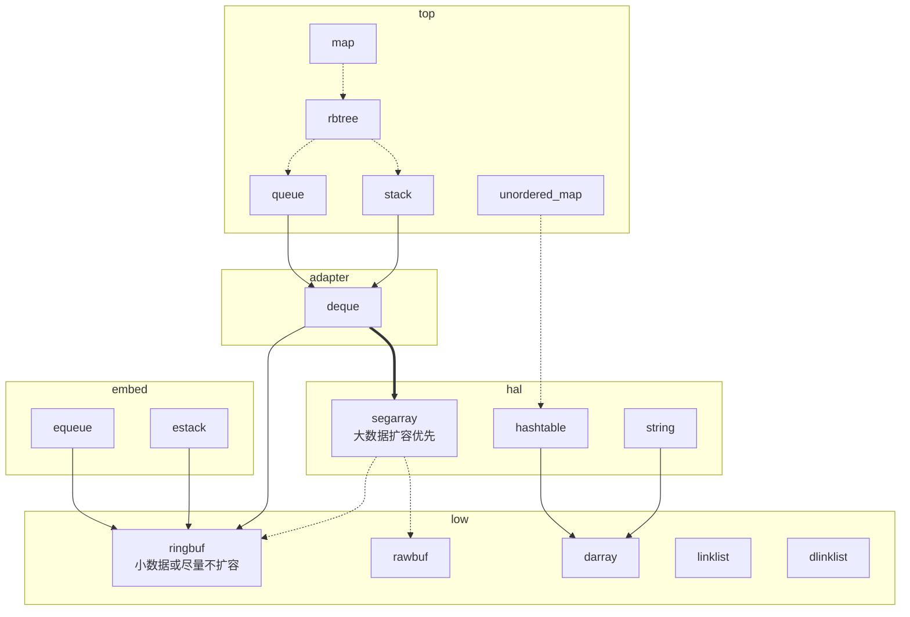

# unicstl

## 简介
基于C语言实现的通用C库，包含常用数据结构和算法。

**全称：** Universal C standard library

**作者：** 温建峰

**主页：** [博客](https://blog.wenjianfeng.top)

**邮箱：**[orig5826@163.com](mailto:orig5826@163.com)

**gitee：**[源码](https://gitee.com/apaki/unicstl)

**github：**[镜像](https://github.com/Orig5826/unicstl)


## 设计架构



## 数据结构

### 基础结构
|数据结构 |名称 |说明 |
|---|---|---|
| darray  | 动态数组 | 扩容
| ringbuf   | 环形缓存区 | 扩容/外部缓存
| linlist   | 单链表 | 
| dlinlist   | 双向链表 |
| rawbuf | 原始缓冲区 | 动态分配固定容量/外部缓存
| segarray | 分段数组 | 扩容

### 容器结构
|数据结构 |名称 |说明 |
|---|---|---|
| deque  | 双端队列 | 扩容
| stack  | 栈 | 扩容
| queue  | 队列 | 扩容

### 嵌入式结构
|数据结构 |名称 |说明 |
|---|---|---|
| estack | 栈 | 外部缓存
| equeue  | 队列 | 外部缓存


## 接口函数原型
```c
// -------------------- 初始化 --------------------
struct* new(size_t obj_size, size_t capacity);  // 创建
void free(struct**);                            // 释放

bool init(size_t obj_size, size_t capacity, void *mem_base);    // 静态初始化，支持传入外部缓存

// 外部实现
int compare(void* obj1, void* obj2);    // 比较函数，若调用了和比较有关的接口，需要在初始化后配置（树、图必须）

// -------------------- 核心功能 --------------------
// 核心操作
bool push(const void* obj);             // [栈、队列] 入栈/入队
bool push_front(const void* obj);       // [双端队列] 头部入队
bool push_back(const void* obj);        // [双端队列] 尾部入队
bool append(const void* obj);           // [动态数组] 追加元素 <push_back>

bool pop(void* obj);                    // [栈、队列，动态数组] 出栈/出队/移除元素
bool pop_front(void* obj);              // [双端队列] 头部出队
bool pop_back(void* obj);               // [双端队列] 尾部出队

bool peek(void* obj);                   // [栈]            查看栈顶元素
bool front(void* obj);                  // [队列、双端队列] 查看头部元素
bool back(void* obj);                   // [队列、双端队列] 查看尾部元素

// 基础操作
size_t size();                          // 获取大小
size_t capacity();                      // 获取容量
bool empty();                           // 判断是否空
bool full();                            // 判断是否满
void clear();                           // 清空

// 迭代器操作
iterator_t iter(...);                   // 返回迭代器
bool iter_hasnext();                    // 是否有下一个元素
const void* iter_next();                // 迭代器下一个元素 <只读访问>

// 索引操作
size_t index(void *obj);                // 获取元素索引, -1为不存在
bool contains(const void* obj);         // 判断元素是否存在 <返回bool>

bool insert(size_t index, const void* obj);     // 插入元素
bool remove(size_t index, const void *obj);     // 删除元素 < delete !!!废弃：防止项目用于C++，关键字冲突>
bool set(uint32_t index, const void* obj);      // 设置元素
bool get(uint32_t index, void* obj);            // 获取元素
const void* at(size_t index);                   // 获取元素指针

// 统计
uint32_t count(const void* obj);    // 统计元素的个数

// 树
bool insert(const void* obj);       // [树] 插入元素
bool delete(const void* obj);       // [树] 删除元素
bool add_(const void* obj);         // [图：顶点、边] 添加元素 <add不考虑位置关系>
bool del_(const void* obj);         // [图：顶点、边] 删除元素 
bool find_(const void* obj);        // [图：顶点、边] 查找元素
```

### 分支命名
|命名   |说明 | 示例
|:----: |:----: | ----
| master | 主分支 | master
| dev | 开发分支 | dev-stack
| test | 测试分支| test-tree
| release | 发布分支 | v1.2.5
| feature | 新功能分支 | feature-tree
| bugfix | bug修复分支 | bugfix-map
| refactor | 重构分支| refactor-darray

## 修改日志

### Unicstl 0.0.10 (2026-5-11)
- new features
    - add darray/ringbuf/linlist/dlinklist
    - add estack/equeue for embedded
    - darray add function: search/sort
    - add algo: sort and search
- refactor: 
    - deque base on ringbuf
    - stack base on deque 
    - queue base on deque

### Unicstl 0.0.02 (2025-05-06)
- new features
    - graph add function: add/del/find vertex/edge
    - graph add function: bfs/dfs
    - tree add new iterator and optimize code
    - deque add order select and delete some functions
    - iter change the name of container/index...
    - list optimize code and add slice function
    - unicstl add default function

### Unicstl 0.0.01 (2025-04-24)
- new features
    - add stack
    - add queue
    - add deque
    - add list
    - add heap
    - add tree
    - add graph
    - add iterator
