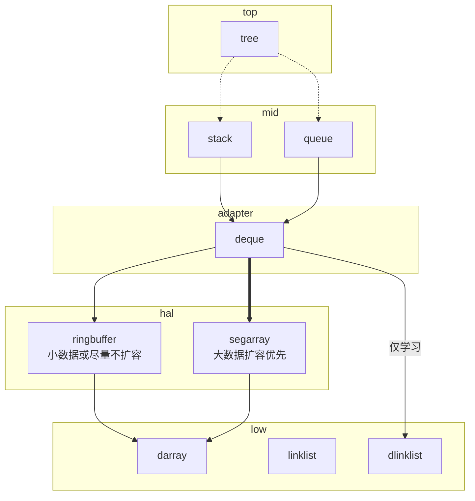

# unicstl

## 架构

```mermaid
flowchart TB
    subgraph low
        darray
        linklist
        dlinklist
    end

    subgraph hal
        ringbuffer[ringbuffer<br>小数据或尽量不扩容] --> darray
        segarray[segarray<br>大数据扩容优先] --> darray
    end

    subgraph adapter
        deque -->|仅学习| dlinklist
        deque ==> segarray
        deque --> ringbuffer
    end

    subgraph mid
        stack --> deque
        queue --> deque
    end

    subgraph top
        tree -.-> stack
        tree -.-> queue
    end
```
