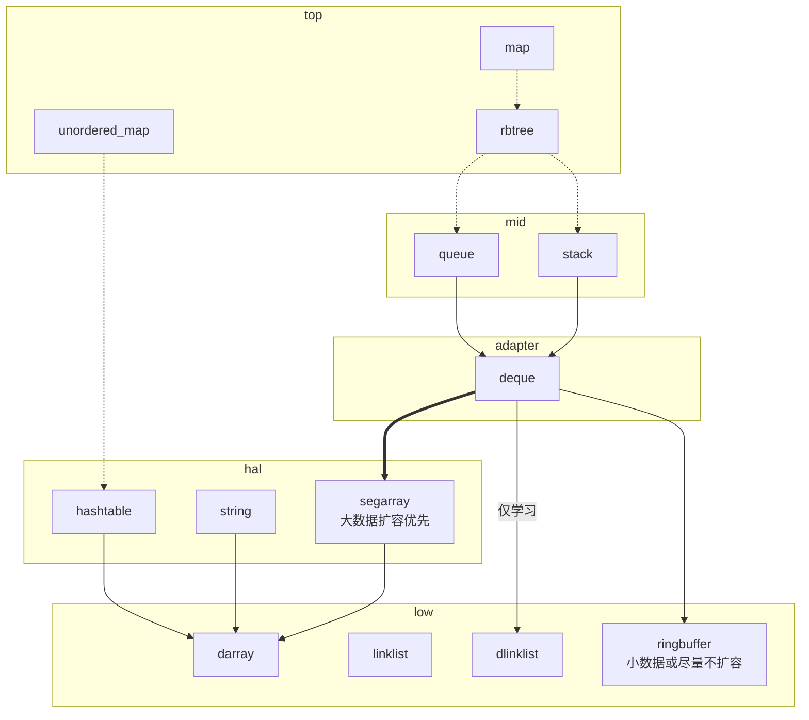

# unicstl

## 架构

```mermaid
flowchart TB
    subgraph low
        darray
        linklist
        dlinklist
        ringbuffer[ringbuffer<br>小数据或尽量不扩容]
    end

    subgraph hal
        segarray[segarray<br>大数据扩容优先] --> darray
        string --> darray
        hashtable --> darray
    end

    subgraph adapter
        deque -->|仅学习| dlinklist
        deque ==> segarray
        deque --> ringbuffer
    end

    subgraph mid
        stack --> deque
        queue --> deque
    end

    subgraph top
        rbtree -.-> stack
        rbtree -.-> queue

        map -.-> rbtree
        unordered_map -.-> hashtable
    end
```
